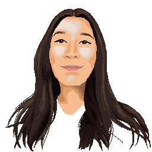

<h2 align="center"> Hi there, I'm Lea Button! </h2>

<h4>I'm a 1st year Computer Science student at the <a href="https://www.sheffield.ac.uk">University of Sheffield</a>!</h4>

&nbsp - I am currenty learning Java and I am confident in Python

&nbsp - I'm particularly interested in Cyber Security and Cryptography

&nbsp - I also enjoy competing in CTFs 

&nbsp - Fun fact! I made that gif of me

&nbsp 🏆 National Cyber Awards, Cyber student of the Year 2021 finalist 

&nbsp 🏆 FDM EveryWoamn, One to Watch 2022 finalist 

<!-- 

 -->

  &nbsp;&nbsp;

